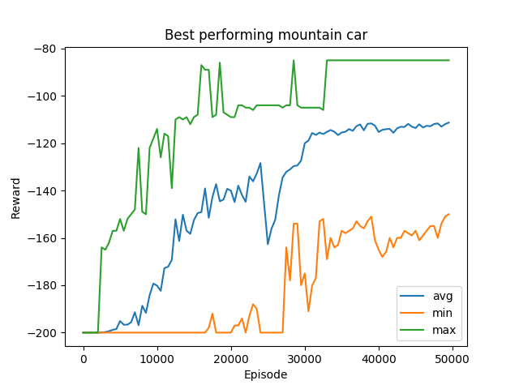

# MountainCar-v0 Q-learning

The goal of the environment is to drive up a mountain with a car.
The challenge of this environment is that the engine of the motor is not strong
enough to drive up the mountain in one go but has to drive back and forth to
build up momentum. More info about the MountainCar environment can be found
[here](https://gym.openai.com/envs/MountainCar-v0/).

Results of implementation:

